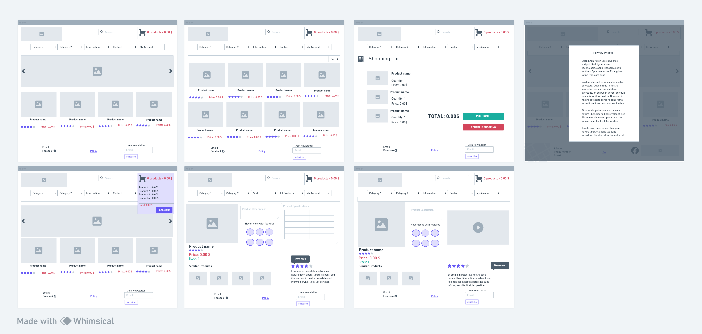

 # Glacial AC


## A Air-Conditioners and Air-Purifiers E-commerce Store.
> A Air-conditioners and Air-purifires e-commerce website that provides high quality products for sale.


### - By Oscar Eriksson

## **[Live site](https://glacial-ac-d07dd9f0063c.herokuapp.com/)    |    [Repository](https://github.com/Oile995/Project5)**

---
  
## Table of contents
<a name="contents">Back to Top</a>
 1. [ UX ](#ux)
 2. [ Business Model ](#biz)
 3. [ SEO ](#seo)
 4. [Agile Development](#agile)
 5. [ Features ](#features)  
 6. [ Features Left to Implement ](#left)  
 7. [ Technology used ](#tech) 
 8. [ Testing ](#testing)  
 9. [ Bugs ](#bugs)  
 10. [ Deployment](#deployment)
 11. [ Credits](#credits)
 12. [ Content](#content)  
 13. [ Acknowledgements](#acknowledgements)  

---

## UX

<a name="ux"></a>

### Database Schema

<details>
<summary> Database Structure</summary>
<br>

This was the suspected preproject planning database structure. As the project was being developed some other models was added and a extra fields added to cover the scope.


</details>

---
<details>
<summary>Profile App</summary>
<br>

#### Profile Model

| id | Field |
|--|--|
|user |OnetoOneField|
|default_phone_number|CharField|
|default_street_address1|CharField|
|default_street_address2|CharField|
|default_town_or_city|CharField|
|default_county|CharField|
|default_postcode|CharField|
|default_country|CharField|

</details>

---

<details>
<summary>Checkout App</summary>
<br>

#### Order Model

| id | Field |
|--|--|
|order_number|CharField|
|user|ForeignKey|
|Full_name|CharField|
|email|EmailField|
|phone_number|CharField|
|country|CountryField|
|postcode|CharField|
|street_address1|CharField|
|street_address2|CharField|
|town_or_city|CharField|
|county|CharField|
|date|DateTimeField|
|deliver_cost|DecimalField|
|order_total|DecimalField|
|grand_total|DecimalField|
|original_cart|TextField|
|stripe_pid|CharField|

#### OrderLineItem Model
| id | Field |
|--|--|
|order|ForeignKey|
|product|ForeignKey|
|quantity|IntegerField|
|lineitem_total|DecimalField|

</details>

---

<details>
<summary>Contact App</summary>
<br>

#### Contact Model

|id|Field|
|--|--|
|email|EmailField|
|subject|CharField|
|message|TextField|
|reason|CharField|

</details>
  
---

<details>
<summary>Products App</summary>
<br>

#### Category Model

|id|Field|
|--|--|
|name|CharField|
|friendly_name|CharField|

#### SubCategory Model

|id|Field|
|--|--|
|category|Foreignkey|
|name|CharField|
|friendly_name|CharField|

#### Icon Model

|id|Field|
|--|--|
|hover_text|CharField|
|image_URL|URLField|
|image|ImageField|

#### Product Model

|id|Field|
|--|--|
|subcategory|ForeignKey|
|sku|CharField|
|product_name|CharField|
|slug|SlugField|
|brand|CharField|
|description|CharField|
|specification|CharField|
|price|DecimalField|
|stock|IntegerField|
|rating|IntegerField|
|image_url|URLField|
|image|ImageField|
|active_deal|IntegerField|
|user_wishList|ManytoMany|
|icons|ManytoMany|


#### Review Model

|id|Field|
|--|--|
|user|ForeignKey|
|product|ForeignKey|
|rating|FloatField|
|comment|TextField|
|created_at|DateTimeField|
  
</details>

## UX design

### Wireframes

<details>
<summary> Wireframes </summary>
<br>



</details>

[Back to Top of page](#contents)

---

# Business Model

<a name="biz"></a>

#### Business Overview

The business is a B2C e-commerce platform whose goal is to provide quick, safe and easy shopping for your new ac-solution

The types of products are top of the line ACs and Air-purifiers to a competietive price!

The benefits for the business owner are:

1. Easy to scale the business as it grows
2. No need to set up a physical location other than a warehouse
3. Can cater to customers within shipping distance
4. A safe and easy option in todays market of ordering from home


The cons of this business model are:

1. Starting up will cost as buying up a stock requires inital funding
2. Establishing a brand from the ground up takes time and immediate results are unlikely without a sound marketing strategy.
3. Getting customers organically takes time so the business would need to manually market the business or use paid advertising.
4. Not having a physical business can make it harder to build trust and loyalty with customers without offering discounts and offers.
5. Establishing a network both for shipping and installing can be difficult in a competetive market
6. Storage cost

Taking the pros and cons of this business, a subscriptions setup would only work for repairs and maintenance. However these are options that are usally included in the order.

Start up as ecommerce and once good installer-network relationsships are established, maintenace subscriptions could be optional, once warrenty is out.

---

#### Site User
User 1: Home owners that require Air-conditioner/Purifier solutions. 

User 2: Work/office owners that require Air-conditioner/Purifier solutions. 

User 3: Store owners that require Air-conditioner/Purifier solutions. 

User 4: Keeper of public places (hospitals, townhall, etc) that require Air-conditioner/Purifier solutions. 

---

####  Goals for the website
The goals for the website are:
- An easy to navigate website with clear purpose
- Quickly search or sort for Products
- Clear Product detailed view, with intuitive design
- Provide users with products that meet their expectations
- Subscribe to newsletter and facebook page for new updates.
- Allow users to checkout quickly and easily
- To allow users to create a profile to view past orders and update profile information

---

#### Marketing Strategy
The businesses marketing strategy going forward is:

1. Promote the store through it's facebook business page. This can be viewed in the SEO section.
2. Share the page with friends and family
3. Gain subscribers through the mailchimp option on the site and then send out offers and promotions to encourage repeat business
4. Potentially use paid advertisement like google ads, facebook ads to promote to our target demographic.
5. Set up multiple ads with a different product as the cover image, track the click through rate and stick with the high peformers.


[Back to Top of page](#contents)

---

# SEO

<a name="seo"></a>

### Keywords

GlacialAC, Glacial, Ac, Air-conditioner, Air-Purifier, split-system, multi-split-system, portable, AC-service, 
ecommerce, webshop, webstore, shipping, order, facebook-group, cool air, heating, cooling, moisturizing,
Midea, Toshiba, Tesla, Vivax, Xiaomi, affordable acs, Top of the line, AC solutions, AC for businesses, AC for home, AC for appartments.


### Sitemap.xml
I generated a sitemap for the site so that once ready engines like google can search it effectively.

### Robots.txt
I generated a robots.txt file so that google could crawl the site. I have blocked off the accounts and cart app as there is no benefit for google to crawl those pages.

### Logo
For the favicon and logo for facebook I needed to manually create a logo to fit the theme of the store.

I created a custom logo in Canva. This logo can be seen in the favicon of the site and on the facebook business page.

### Facebook Business Page

To view the facebook business page you can click on the link below:

[Facebook Business Page](https://www.facebook.com/glacialacsweden)

In case the page becomes inactive or deactivated by Facebook I have taken screenshots to display here also:

<details>
  <summary>Facebook Business Page Screenshots</summary>
  <br>


</details>

[Back to Top of page](#contents)

---

## Agile Development

<a name="agile"></a>

### Agile Overview
Once I had an initial idea of the website I was going to build I created my Epics, user stories and then Wireframs + ERD. I Created a inital Milestone and then new weekly milestones that i tried to follow.

It gave me an idea of how long this project was expected to take and how to manage my workload effectively.

As I worked through the workload I moved tasks from not started to in progress to completed once the task was done. Occasionally I would find other work that were either new tasks or subtasks that required attention before completing a larger task.

I also documented some of the bugs I have come across in the readme

### Github Project Board
To see the final project board for Glacial AC (Project 5) you can click the link below:
[Glacial AC Project Board](https://github.com/users/Oile995/projects/2)


#### Epics

 1. [EPIC: Create base of project](https://github.com/Oile995/Project5/issues/2)
 2. [EPIC : Authentication](https://github.com/Oile995/Project5/issues/3)
 3. [EPIC : View & Navigation](https://github.com/Oile995/Project5/issues/4)
 4. [EPIC : Search & Sorting](https://github.com/Oile995/Project5/issues/5)
 5. [EPIC : Purchase/Payments](https://github.com/Oile995/Project5/issues/6)
 6. [EPIC : Social media/Marketing](https://github.com/Oile995/Project5/issues/7)
 7. [EPIC : Create, Update & Delete Products](https://github.com/Oile995/Project5/issues/8)


Each Epic may have one or more user stories associated and each user story may have tasks.

The full breakdown of user stories and tasks are included on the project board above.

[Back to Top of page](#contents)

---

## Features

<a name="features"></a>

<details>
<summary> Navigation </summary>
<br>

The Desktop navigation was based on Boutique Ado and seemed like a concise and clear option for an e-commerce store. 


Mobile Navigation
  


Sorting, searching and category selection in nav bar


Product management if logged in as superuser


  
When developing this application I decided I wanted to add a detailed footer as would be found on most e-commerce websites.


</details>

<details>
<summary> Products Page </summary>
<br>

The products page is responsive to allow equal spacing between products regardless of screen width.
  


In Product details users have wishlist toggle button and superuser have delete+edit buttons.


User can see similar products at he bottom and next to it reviews as well as adding one if logged in


</details>

<details>
<summary> Cart & Checkout Flow </summary>
<br>


  
Once the customer makes a successful paymeent they are redirected to the payment success page where they see a summary of their order. 

</details>


<details>
<summary> Account Profiles </summary>
<br>

The account profiles app was designed to show shipping details, past orders and wishlist.
The facility to update their account information, change their shipping address.


</details>


<details>
<summary> Privacy Policy </summary>
<br>

Privacy policy modal found in footer.


  

</details>


#### Account restrictions:

When an unverified or not logged in user trys to access the accounts section of the site they are notified they do not have permissions and then redirected back to home.

[Back to Top of page](#contents)

---

<a name="left"></a>
## Features left to Implement 

#### More Categories
I want to add more categories and tailor navigation and sorting based on these. Right now it is mainly basing it on Subcategory then product.

#### Subscription/maintenance setup
I want to create a subscription based maintenance scheduler for users who have previously bought products that demand it.

#### Order Tracking
Going forward I would like to add an order tracking system for the user profile section. Once order placed the merchant can move the product to dispatched and add tracking that can then be viewed by the customer from within their account and also receive an email with the updates.

#### Front end order tracking and accounts management for business
This would involve creating a front end accounts page to display orders and graphs for employees of the business beyond django cms. 
These would allow the business to track orders over days, months and year on year as well as track most popular products.

[Back to Top of page](#contents)

---

<a name="tech"></a>
##  Technology Used

### Html

 - Used to structure my website

### CSS

 - Custom css taken from the boutique ado project and custom made for this project

### JavaScript

 -  Used to add timeout function for messages as well as to enable the menu on index.html. Back to top and clickevents + the mailchimp form.

### Python

 -  Used for the logic in this project.

### Django

 -  Framework used to build this project. Provides a ready installed admin panel and includes many helper template tags that make writing code quick and efficient.

### Font Awesome

 -  Icons used through bootstrap

### Bootstrap 4
 - Used as the base front end framework to work alongside Django and add in html styling to divs.

### Summernote with Django
 - Used for advance fields in product forms, specs and description

### GitHub
 - Used to store the code for this project & for the projects Kanban board used to complete it.

### Heroku
 - Used to host and deploy this project

### ElephantSQL
 - ElephantSQL was used as the database for this project during development and in production.

### Git
- Used for version control throughout the project and to ensure a good clean record of work done was maintained.

### Gitpod
- Used as IDE.

### AWS S3 and IAM
- Used to host static and media files for this project and IAM for the permissions based roles for accessing the S3 buckets.

### Django-Crispy-Forms
- Used to style the forms in this project.

[Back to Top of page](#contents)

---

<a name="testing"></a>
## Testing


### Testing Phase

#### Manual Testing

> If the intended outcome completes then this will be flagged as pass. If it does not then this is a fail.

Please see a table of acronyms used throughout testing:

| Key | Value |
|--|--|
|NLI|Non logged in user|
|LIU|Logged in customer who does not have staff permissions.|
|SUP|Superuser or staff permissions


<details>
<summary>Account Registration Tests </summary>
<br>

| Test |Result  |
|--|--|
|User can create an account | Pass |
|Verified User can log into account| Pass|
|User can log out of account|Pass|
|User is notified of logging in to account|Pass|
|User is notified of logging out of account|Pass|
|User receives email verification email|Pass|
|Registration fields have restrictions|Pass|

</details>

---

<details>
<summary>User Navigation Tests</summary>
<br>

| Test |Result  |
|--|--|
|User can navigate to product| Pass |
|User can access product details| Pass|
|User can add a product to cart|Pass|
|User can navigate back to products|Pass|
|User can add additional products to cart|Pass|
|User can add multiple quantities of a product |Pass|
|User can navigate to cart|Pass|
|Logged in User can navigate to the profile section of accounts|Pass|
|User can access their saved address information|Pass|
|User can access past orders|Pass|
|User can access the search for products|Pass|
|User can access specific categories|Pass|
|User can filter products|Pass|
|All links on footer open to correct pages|Pass|
|All links on Heading Navigation open to correct option|Pass|

</details>

---

<details>
<summary>Account Security Tests</summary>
<br>

| Test |Result  |
|--|--|
|NLI cannot make reservation | Pass |
|NLI cannot access profile page| Pass|
|NLI cannot access admin panel|Pass|
|NLI cannot access products management|Pass|
|NLI cannot delete or edit products|Pass|
|NLI cannot leave comments on blog|Pass|
|LIU cannot access admin panel|Pass|
|LIU cannot access products management|Pass|
|LIU cannot delete or edit products|Pass|
|LIU can leave review on products articles|Pass|
|SUP is the only one that can access admin panel and front end CRUD form|Pass|


</details>

--- 

<details>
<summary>Profile Tests</summary>
<br>

| Test |Result|
|--|--|
|NLI cannot access profile page | Pass |
|LIU can access profile page|Pass|
|LIU can see their details on the accounts home page|Pass|
|LIU can update their phone number|Pass|
|LIU can update street address 1 and 2|Pass|
|LIU can update town or city|Pass|
|LIU can update county|Pass|
|LIU can update postcode|Pass|
|LIU can update country|Pass|
|When user logout they are redirected to the home page|Pass|

</details>

---

<details>
<summary>Admin Tests</summary>
<br>

| Test |Result  |
|--|--|
|SUP can access admin panel by manually updateing url field | Pass |
|SUP can access add product page from Product management dropdown|Pass|
|SUP can see the edit product option on the products page|Pass|
|SUP can see the delete option on the products page|Pass|
|SUP can add categories, subcategories, products, icons, orders and reviews from the admin panel|Pass|
|SUP can edit products and update all fields successfully|Pass|
|SUP can delete products from the products page and it has a heads up modal|Pass|

</details>

---

<details>
<summary>Site wide tests</summary>
<br>

| Test |Result  |
|--|--|
|User can navigate to privacy policy|Pass|
|User can navigate to email link|Pass|
|User can navigate to Copyright repository|Pass|
|User can sign up to newsletter from footer|Pass|
|Social links open up to the correct pages|Pass|
|Social links open up in a new tab|Pass|

</details>

---

<details>
<summary>Payment Tests</summary>
<br>

| Test |Result  |
|--|--|
|NLI can successfully make a payment & order| Pass |
|LIU can successfully make a payment & order| Pass|
|All users receive an email confirmation of order on deployed site|Fail|
|If payment is successful user will be redirected to order success page|Pass|
|If order fails due to incorrect information being submitted order will not be submitted|Pass|
|If there is an error when processing the order the site returns a 500 error without processing order|Pass|

</details>

---

<details>
<summary>Mobile view</summary>
<br>

| Test |Result  |
|--|--|
|User can access all pages of the site in mobile view| Pass |
|Pages scale down to mobile view,centering content| Pass |
  
</details>

---

## Google Lighthouse Testing

### Desktop

> index.html

<details>
  <summary>Index.html Screenshot</summary>
  <br>


  
  </details>

> profile.html

<details>
  <summary>Profile.html Screenshot</summary>
  <br>
  

  
  </details

## HTML W3 Validation

### index.html

<details>
  <summary>W3 HTML Validation Screenshot</summary>
    </br>


  
  </details>
  
#### Result: No Errors

### CSS Validation

<details>
  <summary>W3 CSS Jigsaw Screenshot</summary>
  </br>
  


</details>

#### Result: No Errors

[Back to Top of page](#contents)

---

<a name="bugs"></a>
## **Bugs**

<details>
<summary>Bugs</summary>
<br>

1. Deployment crashed site on everything but index.html
- The problem was that there was a typo in the database if statement in settings causing the site not reaching the database
2. Static files did not update on page
- Due to the AWS setup being slightly different than walkthrough, I selected the wrong thing during user creation and the worng keys was used in heroku variables.
3. Product details page being scrollable sideways in mobile view
- Two bugs, due to offset to revieve form on mobile view, caused it to extend he page to the right. Imbedded from in summernote had fixed width that did not scale in mobile. both fixed with adding width :100%
4. webhooks not working in gitpod port 8000. 
- The problem was that port 8000 is set as private as default and it caused stripes webhooks not be able to communicate.

</details>


[Back to Top of page](#contents)

---

<a name="deployment"></a>
## Deployment

### Deployment to Heroku

This application is deployed with Heroku.

<details>
  <summary>The steps for deploying through Heroku are as follows:</summary>
  <br>

1.  Visit Heroku and login
2.  Click on New and then choose New App.
3.  Choose a name for your app and then choose your region.
4. Ideally select the region closest to you
5.  Then press 'Create app'.
  
</details>


<details>
  <summary>To attach The Database:</summary>
  <br>

1. Login or sign up to  [ElephantSQL](https://www.elephantsql.com/).
2. Press create a new instance.
3. Choose a name and plan. Then click on select region. 
4. Select the closest Data Center to you
5. Click on "Create Instance".
6.  Go back to the start page and click on your new database.
7.  Copy the URL for the database.
  
 </details>


Go back to Heroku and click on the settings tab of your application.
    
Click on "Reveal config vars".

Add a new config var named DATABASE_URL and paste in the URL from  ElephantSQL  as the value.

Go back to Gitpod or the IDE you are using and install two more requirements for the database:

  `pip3 install dj_databse_url`
  `pip3 install psycopg2-binary`
  
Update your requirements.txt file by typing in  `pip3 freeze --local > requirements.txt`

Add the DATABASE_URL to your env.py file or environment variables in gitpod.

Go to settings.py and  `import dj_database_url`

Comment out the default  `DATABASES`  setting.

Add this under the commented out section:

``` DATABASES = {
    'default': dj_database_url.parse(os.environ.get('DATABASE_URL')) }

```
Run migrations for the new database.

1.  In the root directory of your project, create a file called "Procfile" and add  `web: gunicorn project_name.wsgi`  so Heroku will know what kind of application it is.
    
2.  In settings.py add ['app_name.heroku.com', 'localhost'] to  `ALLOWED_HOSTS`.
    
3.  Commit and push these changes to GitHub.
    
4.  In the Heroku settings tab of your project update the config vars to the following:

| Key | Value  |
| -- | -- |
|AWS_ACCESS_KEY_ID|From AWS in CSV Download|
|AWS_SECRET_ACCESS_KEY|From AWS in CSV Download|
|DATABASE_URL|From ElephantSQL dashboard|
|EMAIL_HOST_PASSWORD|App Password from Email Client|
|EMAIL_HOST_USER|Email address|
|SECRET_KEY|Randomly Generated Django Key|
|STRIPE_PUBLIC_KEY|Publishable key from Stripe Dashboard|
|STRIPE_SECRET_KEY|Secret key from Stripe Dashboard|
|STRIPE_WH_SECRET|Signing secret from Stripe Webhooks Endpoint|
|USE_AWS|True|

If you deploy at the beginning of the project then add the key value of: `DISABLE_COLLCETSTATIC`  and set it to 1. When you have  staticfiles to push then remove this variable.

Once the project is completed and you are no longer working on it set  `DEBUG`  =  `False`  in settings.py.

Log in to Heroku and select the deploy tab on your Heroku App and connect your GitHub account.

Search for your repository and connect it.

Once you have selected the correct repository, scroll down and click "Deploy Branch".

Watch the log as it deploys your project and ensure there are no errors.

If everything is correct it should deploy successfully.

Click on open app at the top of the page to view your deployed app.

---

### Clone project

<details>
  <summary>How to clone of the repository:</summary>
  <br>

1.  Click on the code tab under the repository name.
2.  Then click on "Code" button to the right above the files listed.
3.  Click on the clipboard icon to copy the URL.
4.  Open Git Bash in gitpod or your preferred IDE.
5.  Change the working directory to where you want your cloned directory.
6.  Type  `git clone`  and then paste the URL that you copied.
7.  Press enter and clone is complete.
8.  In the terminal install the requirements by using the following: pip3 install -r requirements.txt
9. Next create the env.py file which tells our project which variables to use.  
10. Add the file to a .gitignore to prevent it from being pushed to github
11. Make migrations by running :  `python manage.py makemigrations`
12. Then migrate those changes with  `python manage.py migrate`
13. To run the project type  `python manage.py runserver` into the terminal and open port 8000.
14. This will open the project locally for you to work on.
  
  </details>

---

#### Forking the repository on GitHub

The steps to fork this repository are:

 1. Login to github and find the respitory  [here](https://github.com/Oile995/Project5)
 2. Under your profile photo on the right hand side you will see the fork button.
 3. Click the fork button and github will create a copy to your account.


[Back to Top of page](#contents)

---
  
<a name="credits"></a>
## Credits

##### My lovely Wife
- She helped me with populating the deployed website with Products and Icons.
- She also helped with creating logos and images in Canva
- Supported me with food and moral support while i grinded.

##### Code-institute
- I used the Boutique Ado walkthough to get started with my project and tailored my site after my own design after the skeleton was in place
- Checkout/Cart are from Boutique Ado.
- Product card setup from Code-institute.

##### Wishlist: 
- I got the wishlist functions from and I take no credit  https://github.com/veryacademy/django-ecommerce-project/tree/main

##### Star-rating:
- I got the star-rating logic and styling from and I take no credit https://github.com/dev-rathankumar/greatkart-pre-deploy/blob/main/templates/store/product_detail.html

#####  Footer 
- I got the footer example from https://mdbootstrap.com/ and tweaked it to the style+content i wanted
- I got the footer fixed position logic from and i take no credit for it https://medium.com/@MadTinez/bootstrap-4-footer-at-bottom-not-sticky-dynamic-footer-height-b37ccec837e2

##### Alan Bushell
  - I used Alans Ecommerce Project Razor sharp repository, for inspiration from Userstories to models/base.html to Readme structure and generic content.
  - I credit the deployment section of this readme to Alan, as we followed the same type of deployment, I re-used his Deployment section of the Readme.

##### Images 
I take no credit for the media used on the site.
  - Logo, icons, placeholder image and sale-deal in carousel created in Canva by my Wife
  - Product images take from https://www.klimamarket.mk and the following:
  * https://www.electroluxhome.se/hem-hushall/klimat-ac/luftrenare/pa91-604gy/
  * https://mistore.se/products/xiaomi-smart-air-purifier-4
  * https://www.maxgaming.se/sv/luftrenare/mi-air-purifier-4-compact-vit-luftrenare
  * Shutterstock through credits.
  * Youtube for the few embedded youtube videos.
  
[Back to Top of page](#contents)

---

<a name="content"></a>
## Content & Resources
  
##### Django Documentation
  - Read through the django documentation multiple times when troubleshooting.
  
##### W3 Schools
  - Used for reference throughout for simple html/css examples.

##### Stack-Overflow
  - I frequently went to stack-overflow when troubleshooting and searching for solutions.

##### Canva
  - Used to create the logo used for the facebook business page and favicon

##### Favicon.ico
  - Used to create the favicon from the logo
  
##### Code Institute
  - Course content for portfolio project 5 helped greatly in being able to complete this project.
  - I found the walkthroughs informative and well paced.
  - Initial structure based heavily on the CI walkthrough until I got more comfortable with the framework and started to make it my own.
  - Checkout, nav, and product card setup is still very close to legacy.
  - I take no credit for the legacy code from the Boutique Ado project which is the Skeleton of this site.

[Back to Top of page](#contents)

---

<a name="acknowlegements"></a>
## Acknowledgements

### Elena
> My wife have been my rock.

### The CI tutor support team
> The Tutor support team in the Code Institute were always on hand to answer my questions when bugs just doesnt make sense

### The CI Walkthrough projects (Boutique Ado mainly)
> The walkthroughs and the source code is a great help when starting and setting up a skeleton of my project.

[Back to Top of page](#contents)